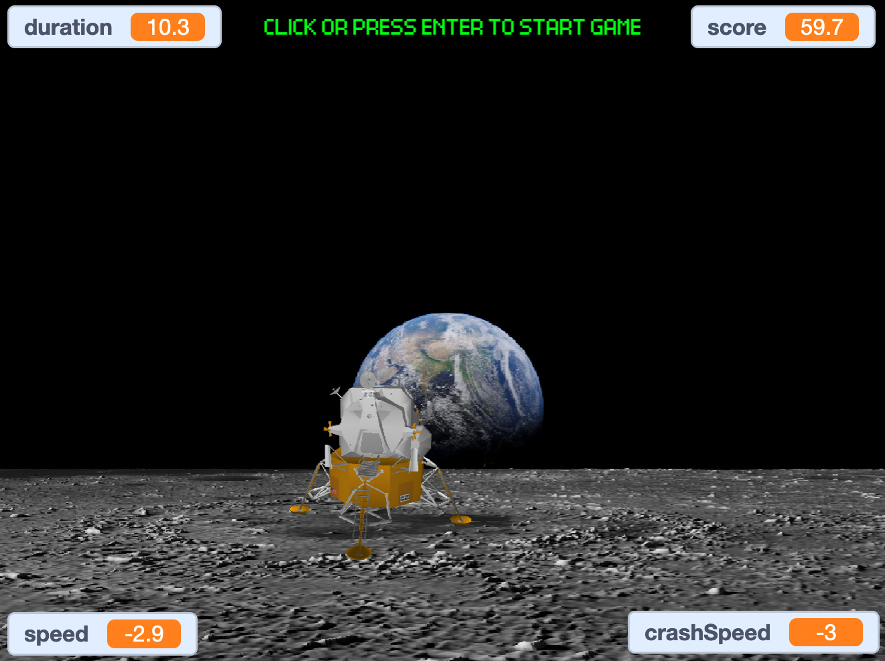
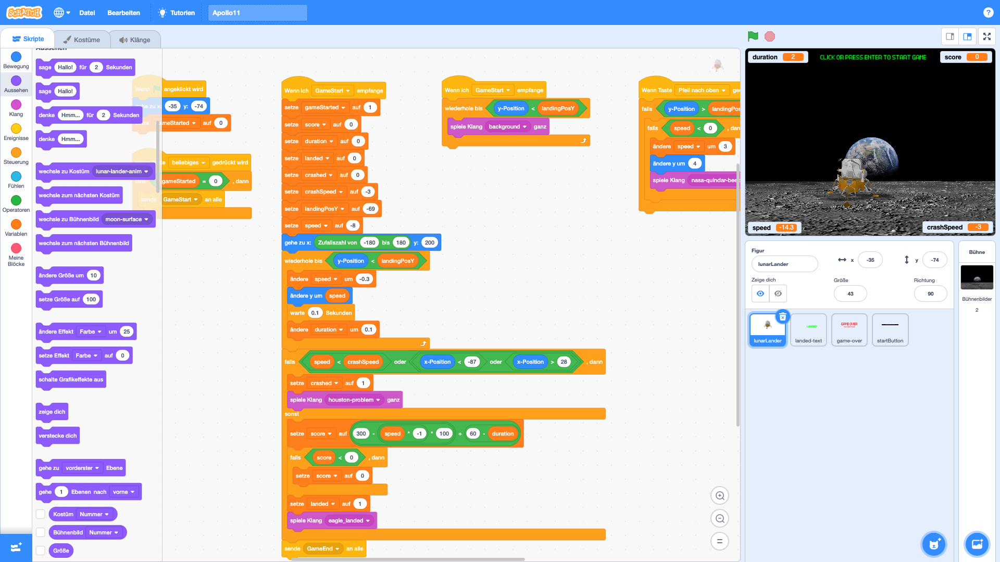

# Apollo 11 landing on the moon

[Play the game in your browser now](https://jankammerath.github.io/scratch-apollo11/apollo11.html)

An Apollo 11 moon landing game in scratch. Land the lunar lander on the surface of the moon. This game allows you to land the lunar lander on the surface of the moon by using the <kbd>←</kbd> and <kbd>→</kbd> to navigate left or right and the <kbd>↑</kbd> to slow the lander down. You should not exceed the crash speed and land in the crate in the center.

## How to run the game yourself

Simply download the [Apollo11.sb3](Apollo11.sb3) file and open it in your Scratch IDE. Then you can run the game yourself.

## How it was packaged

This Scratch application was packaged to HTML using the [TurboWarp Packager](https://packager.turbowarp.org/).
